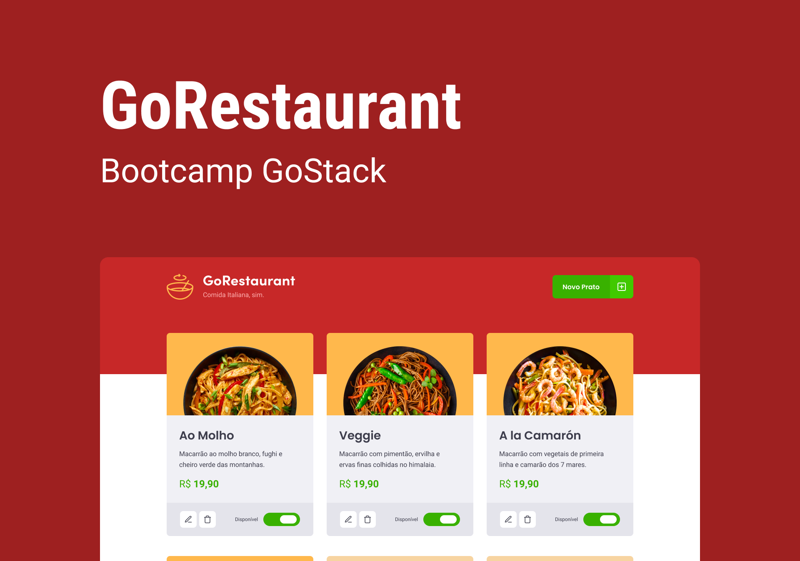

<h5 align=center>
 

🎨 Design por [Tiago Luchtenberg](https://www.instagram.com/tiagoluchtenberg/)

</h5>

---

## 🔖 Sobre

GoRestaurante, uma aplicação que permite adicionar, deletar e atualizar pratos de comida.

## 📥 Executar esse projeto no seu computador

- Clonar Repositório: `git clone https://github.com/dxwebster/GoRestaurant.git`
- Ir para a pasta: `cd GoRestaurant`
- Instalar dependências: `yarn`
- Rodar servidor da aplicação: `yarn json-server server.json -p 3333`
- Rodar Aplicação: `yarn start`

## 🛠 Como criar esse projeto do zero

Em breve...

## 📕 Licença

Todos os arquivos incluídos aqui, incluindo este _Readme_, estão sob Licença MIT. 
Criado com ❤ por [Adriana Lima](https://github.com/dxwebster)
